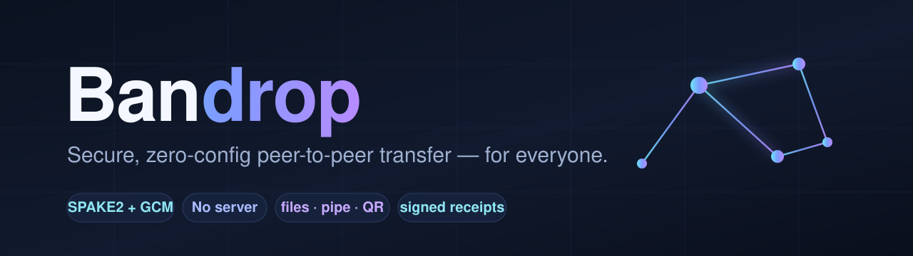
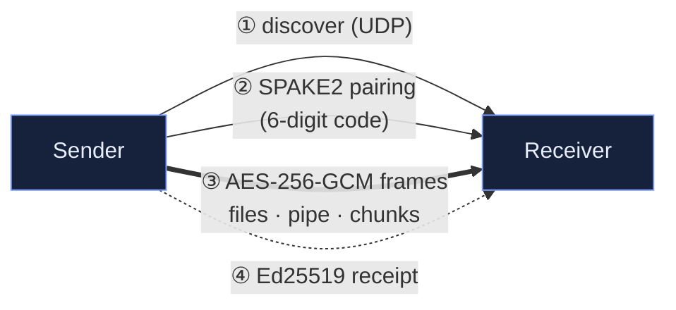

<p align="center">
  
</p>

<p align="center">
  <a href="https://github.com/IlieBanda/bandrop/actions/workflows/ci.yml"></a>
  
  
  
  
  
</p>

<h3 align="center">Send files, pipe commands, or share to a browser &mdash; directly between machines.<br>No cloud. No accounts. No server in the middle.</h3>

<p align="center"><b><a href="#install">Install</a> · <a href="#what-it-does">Commands</a> · <a href="#the-pipe-the-killer-feature">Pipe</a> · <a href="#security-model">Security</a> · <a href="#how-it-works">How it works</a></b></p>

---

Bandrop is a single, dependency-light C++ binary that moves data **peer-to-peer**.
Pairing is a short code; encryption is end-to-end (**SPAKE2** key agreement +
**AES-256-GCM**); the receiver is discovered automatically on your network.
Nothing is ever proxied through a third party.

```console
$ bandrop send ~/photos --to laptop
  PAIRING CODE:  418 273
  Sending 240 item(s), 1.4 GiB total.
  [========================================] 100%  1.4 GiB  312 MiB/s  ETA 00:00
  Signed as 9cf8:2f8b:b56c:a120.
  Done. All items sent and verified end-to-end.
```

## Install

**One line** — builds from source, installs dependencies for you (Linux/macOS):

```bash
curl -fsSL https://raw.githubusercontent.com/IlieBanda/bandrop/main/install.sh | sh
```

<details>
<summary><b>Homebrew · from source · other options</b></summary>

```bash
# Homebrew (tap or local formula)
brew install --HEAD IlieBanda/bandrop/bandrop
brew install --build-from-source ./Formula/bandrop.rb

# From source
cmake -S . -B build && cmake --build build     # -> build/bandrop
sudo make install                              # -> /usr/local/bin/bandrop
```
Requires a C++17 compiler, CMake, OpenSSL and zlib.
</details>

## What it does

| Command | What it's for |
|---|---|
| 📦 `bandrop send <paths…>` | Send files/folders to another machine (auto-discovers the receiver). `--resume`, `--compress`. |
| 📥 `bandrop receive` | Receive a transfer; auto-renames collisions; can save a signed receipt. |
| 🔀 `bandrop pipe` | A secure, paired `stdin↔stdout` pipe between machines — **netcat + ssh, zero-config.** |
| 🌐 `bandrop serve <paths…>` | Share over HTTP + **QR code** so *any browser or phone* can download — nothing to install. |
| 📡 `bandrop broadcast <paths…>` | Fan-out one set of files to **many receivers** with a single code. |
| 🧾 `bandrop verify <receipt>` | Verify a signed transfer receipt offline. |
| 🔑 `bandrop id` · 🔎 `bandrop discover` | Show your identity fingerprint · list receivers on the LAN. |

## Quick tour

### Send & receive

```bash
bandrop receive                       # waits, announces itself on the LAN
bandrop send report.pdf ~/photos/     # auto-discovers it; or --to <ip>
```

Folders keep their structure, every file is SHA-256-verified, existing files are
auto-renamed (or `--overwrite`), and the sender signs a receipt you can keep.
Interrupted a 10 GB folder? `--resume` sends only what's missing.

### The pipe — *the killer feature*

A secure, bidirectional pipe you can drop into **any** Unix pipeline, across
machines, with no ssh and no server:

```bash
# copy a database                          # on the other host
pg_dump mydb | bandrop pipe --to hostB     bandrop pipe --listen > mydb.sql

# move a whole tree, no temp files
tar c ./project | bandrop pipe --to hostB  bandrop pipe --listen | tar x
```

### Serve to a browser (+ QR)

```bash
bandrop serve slides.pdf video.mp4 --once
```

Prints a LAN URL **and a scannable QR code** — open it on a phone, it downloads
in the browser. No Bandrop needed on the other side.

```
█████████████████████████████████
██ ▄▄▄▄▄ ██▄█▀ ██▄▄██▄▀█ ▄▄▄▄▄ ██
██ █   █ █  ████▄█ ▀  ▄█ █   █ ██
██ █▄▄▄█ █  ▄▄█   ▀█▀▄▀█ █▄▄▄█ ██
██▄▄▄▄▄▄▄█ ▀▄█ ▀▄▀▄█ ▀ █▄▄▄▄▄▄▄██
   http://192.168.1.5:8000/…
```

### Broadcast & receipts

```bash
bandrop broadcast slides.pdf     # one code; every receiver gets its own copy
bandrop verify receipt.json      # VALID, signed by 9cf8:2f8b:… + file list
```

## Security model

| Layer | Mechanism |
|---|---|
| **Pairing** | SPAKE2 (RFC 9382, P-256). The code never crosses the wire; an attacker gets **one online guess per connection** — no offline brute force. |
| **In transit** | AES-256-GCM AEAD, fresh nonce per frame — tampering & truncation are detected. |
| **Integrity** | Per-file SHA-256, end to end. |
| **Provenance** | Ed25519-signed receipts; `bandrop verify` checks them offline. |

`serve` is the one deliberate exception: plain HTTP on the LAN so any browser
works. Everything else is end-to-end encrypted and **direct — no relay, ever.**

> Bandrop has a clear threat model (a trusted local network). It's a compact,
> tested tool, not an audited replacement for a hardened transport on a hostile
> network.

## How it works



<details>
<summary><b>Module layout</b></summary>

| File | Responsibility |
|---|---|
| `crypto.h` | AES-256-GCM, HKDF, HMAC, SHA-256, RNG |
| `spake2.h` / `handshake.h` | SPAKE2 PAKE and the pairing exchange |
| `session.h` / `protocol.h` | Sealed, length-framed message channel |
| `net.h` / `discovery.h` | TCP helpers and UDP peer discovery |
| `archive.h` / `compress.h` / `chunker.h` | Directory walking, zlib, content-defined chunking |
| `sender.h` `receiver.h` `pipe.h` `serve.h` `broadcast.h` | The transfer modes |
| `qr.h` | Self-contained QR encoder (verified against a reference) |
| `identity.h` / `receipt.h` / `json.h` | Ed25519 identity & signed receipts |
| `ui.h` | Progress bar, rate/ETA, human sizes |
</details>

## Build & test

```bash
make            # build
make test       # unit tests: crypto, SPAKE2, QR (bit-exact vs reference), JSON, receipts, chunker
bash tests/e2e.sh build/bandrop          # + pipe / serve / receipt / broadcast / resume suites
```

CI builds and runs everything on Linux **and** macOS.

---
<p align="center"><sub>Built with ❤️ by Ilia Banda · MIT licensed · direct peer-to-peer, always.</sub></p>
